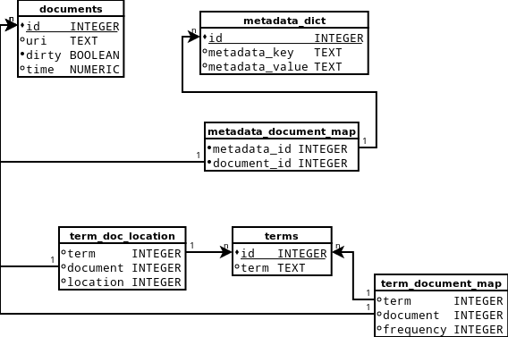

SQLite Table
============

Introduction
------------
This table is going to use a SQLite database as the backend.

There are a few advantages of using a SQLite database as the backend
over flat files:

1. The database can be opened instantly without being loaded in to memory.
1. The need to mark things as "dirty" is less, because deletes will cascade throughout the database.
1. Only one file is stored on disk, making it less likely that one of them will go missing and become corrupt.

However there are disatvantages as well.

1. SQLite has trouble with huge sets of data.
1. Due to the internal structures, the SQLite data files may be much larger than their flat-file counterparts.

Database Description
--------------------

Software Design
---------------
